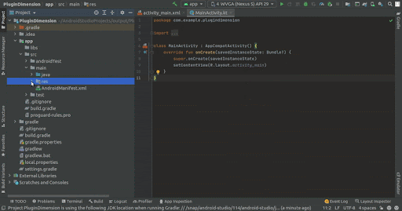
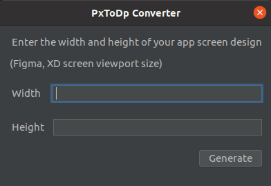

## PxToDp Converter

PxToDp converter creates dimension files to make your UI responsive across all the devices. Simply Input the width and height of your app screen design, and have your responsive UI work on any phone and tablet within seconds.
## How does it work?
PxToDp converter's advanced algorithm auto generates the required responsive UI framework according to developers requirements.
 - Right click on Res folder then select PxToDp plugin

 - In the PxToDp converter, input your app frame design viewport width and height.
   

 - Taking your input, our Responsive PxToDp converter will create the dimes xml file.
 - The file will have required inputs for pxh (pixel horizontally) and pxv (pixel vertically).
 - All the mobile design dimes xml files will be generated in your code.

## Example

| Your regular design xml file  (DP/SP/PX)                                                                                                                                                                                                                                                                                                            | Integration of pxh & phv in your code (PxToDp converter)                                                                                                                                                                                                                                                                                                                                         |
|---------------------------------------------------------------------------------------------------------------------------------------------------------------------------------------------------------------------------------------------------------------------------------------------------------------------------------------------------------|------------------------------------------------------------------------------------------------------------------------------------------------------------------------------------------------------------------------------------------------------------------------------------------------------------------------------------------------------------------------------------|
| <TextView android:id="@+id/txtSkip" android:layout_width="wrap_content" android:layout_height="wrap_content" android:layout_gravity="end" android:layout_marginStart="32dp" android:layout_marginTop="66dp" android:layout_marginEnd="32dp" android:alpha="0.4" android:gravity="center" android:text="Skip" /> | <TextView android:id="@+id/txtSkip" android:layout_width="wrap_content" android:layout_height="wrap_content" android:layout_gravity="end" android:layout_marginStart="@dimen/_32pxh" android:layout_marginTop="@dimen/_66pxv" android:layout_marginEnd="@dimen/_32pxh" android:alpha="0.4" android:gravity="center" android:text="Skip" /> |
